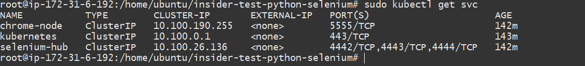
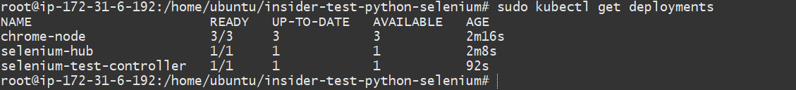
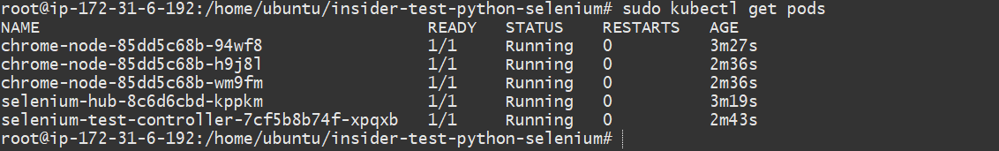
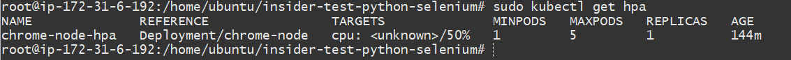
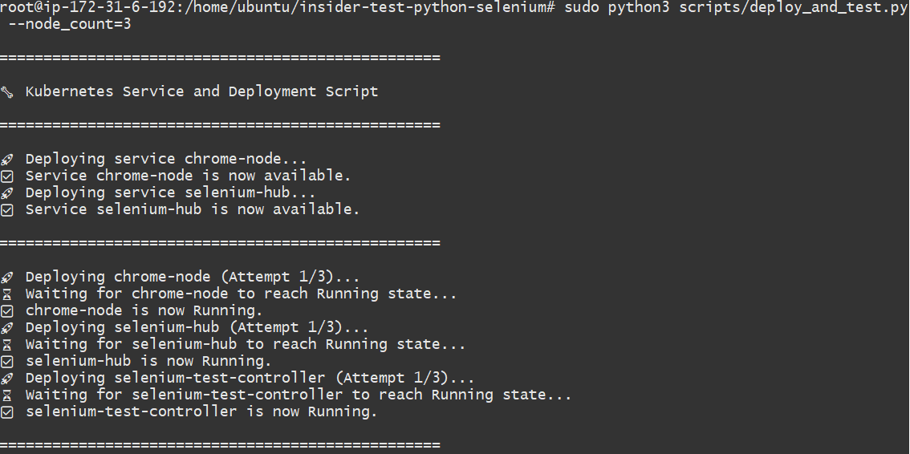
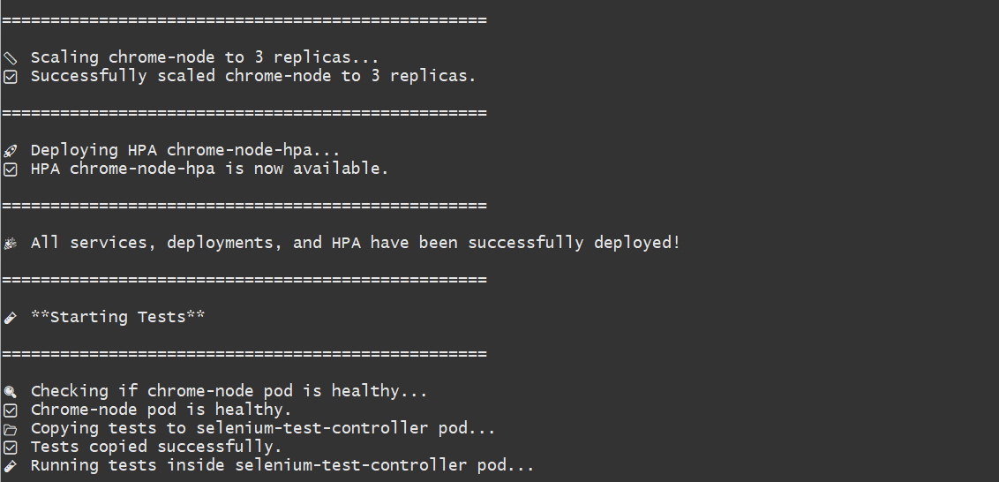
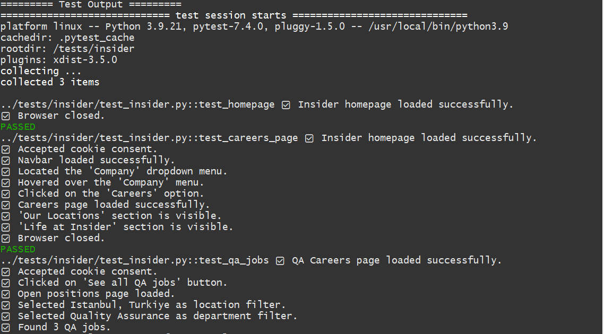
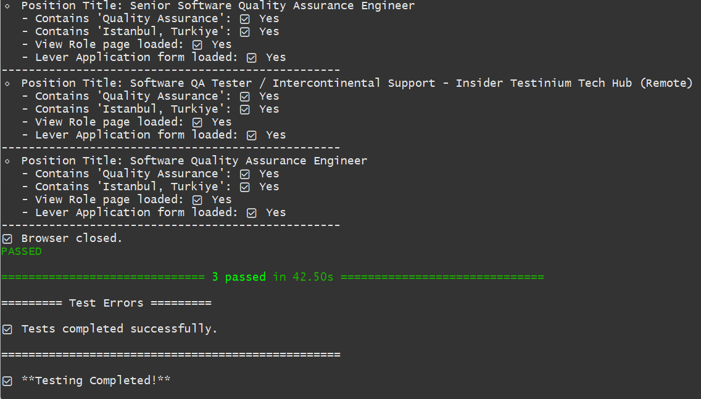
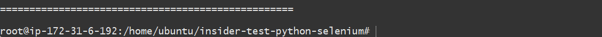

# Insider Python Selenium

This project is focused on creating a **Kubernetes infrastructure on AWS** and running **Selenium Python tests** in that environment. The goal is to automate the process of managing the testing environment using **EKS (Elastic Kubernetes Service)**, **Docker**, and **Selenium** to run automated Chrome browser tests.

## Prerequisites

- **Ubuntu 24.04** EC2 instance on AWS
- AWS account
- Python (for running Selenium tests)
- Docker installed

### How It Works

The `scripts/deploy_and_test.py` Python script automates the process of creating the **EKS infrastructure** and deploying the necessary Kubernetes resources.

1. **EKS Infrastructure Setup**: 
   The script first sets up the **EKS cluster** on AWS. It deploys the Kubernetes **services**, **pods**, and **Horizontal Pod Autoscaler (HPA)** as part of the infrastructure.

2. **Test Deployment**:
   - The script then copies the **tests directory** to the **Test Controller** pod.
   - It uses `pytest` to execute the Selenium Python tests inside the **Test Controller** pod.

3. **Test Execution**:
   - The **Test Controller** pod interacts with the **Chrome-node** pod via the **Selenium Hub** to run the tests in a browser environment.

   - **Selenium Hub**: Acts as a central hub for managing and executing browser tests in the **Chrome-node** pod.
   - The **Chrome-node** pod hosts the actual browser instance for running the Selenium tests.

The combination of these components enables the automated running of browser tests in a Kubernetes environment, using AWS EKS and Selenium with Python.

## Project Setup

### Step 1: Install kubectl

Run the following commands to install `kubectl`:

```bash
curl -LO "https://dl.k8s.io/release/$(curl -Ls https://dl.k8s.io/release/stable.txt)/bin/linux/amd64/kubectl"
chmod +x kubectl
sudo mv kubectl /usr/local/bin/
kubectl version --client
```

### Step 2: Install AWS CLI

Run the following commands to install AWS CLI:
```bash
curl -s "https://awscli.amazonaws.com/awscli-exe-linux-x86_64.zip" -o "awscliv2.zip"
unzip awscliv2.zip
sudo ./aws/install
aws --version
```

Configure AWS CLI:
```bash
aws configure
```
Enter the following details:

- AWS Access Key
- AWS Secret Key
- Region (e.g., us-west-1 for California)
- Output format (choose either json or yaml)


### Step 3: Install eksctl (EKS Management Tool)

Run the following commands to install eksctl, which is a simple command-line utility for creating and managing EKS clusters:
```bash
curl -sLO "https://github.com/weaveworks/eksctl/releases/latest/download/eksctl_Linux_amd64.tar.gz"
tar -xzf eksctl_Linux_amd64.tar.gz
sudo mv eksctl /usr/local/bin/
eksctl version
```

### Step 4: Install aws-iam-authenticator

Run the following commands to install the aws-iam-authenticator:
```bash
curl -LO "https://github.com/kubernetes-sigs/aws-iam-authenticator/releases/download/v0.6.30/aws-iam-authenticator_0.6.30_linux_amd64"
chmod +x aws-iam-authenticator_0.6.30_linux_amd64
sudo mv aws-iam-authenticator_0.6.30_linux_amd64 /usr/local/bin/aws-iam-authenticator
aws-iam-authenticator version
```

### Step 5: Create an EKS Cluster

Create an EKS cluster using the following eksctl command:
```bash
eksctl create cluster --name InsiderTestPython --region us-west-1 --nodegroup-name selenium-nodes --node-type t3.medium --nodes 2
```
This command will create an EKS cluster named InsiderTestPython in the us-west-1 region with a node group called selenium-nodes, which contains two t3.medium nodes.


### Step 6: Configure kubectl to Manage EKS Cluster

Once the cluster is created, configure kubectl to manage your newly created EKS cluster:
```bash
aws eks --region us-west-1 update-kubeconfig --name InsiderTestPython
```

## Docker Installation

### Install Docker on Ubuntu 24.04

Run the following commands to install Docker:
```bash
sudo apt update
sudo apt install -y docker.io
```

### Start and Enable Docker

Start and enable Docker to run at boot:

```bash
sudo systemctl start docker
sudo systemctl enable docker
```

### Verify Docker Installation

Ensure that Docker was installed correctly by checking its version:
```bash
docker --version
```

## Create Elastic Container Registry (ECR)

### Step 1: Create an ECR Repository

To store Docker images in AWS, create an ECR repository:

```bash
aws ecr create-repository --repository-name insider-test-python --region us-west-1
```
Take note of the repository URI (e.g., XXXXXXXXX.dkr.ecr.us-west-1.amazonaws.com/insider-test-python).

### Step 2: Authenticate Docker with ECR

Authenticate your Docker client to interact with the ECR repository:

```bash
aws ecr get-login-password --region us-west-1 | docker login --username AWS --password-stdin XXXXXXXXX.dkr.ecr.us-west-1.amazonaws.com
```
Replace XXXXXXXXX with your AWS account ID.

## Deploy Kubernetes Infrastructure and Run Python Tests

To deploy the **EKS cluster** and run the **Selenium Python tests**, navigate to the project’s root directory and execute the following command:

```bash
sudo python3 scripts/deploy_and_test.py --node_count <value>
```
Where:
--node_count specifies the number of nodes to deploy in the EKS cluster.
Default value: 1
Minimum value: 1
Maximum value: 5

For example, to deploy a cluster with 3 nodes, use:

```bash
sudo python3 scripts/deploy_and_test.py --node_count 3
```

## Output

After successfully deploying the Kubernetes infrastructure and running the Selenium Python tests, you will see the following outputs. Each section includes relevant screenshots for reference.

### Kubernetes Services

Once the EKS cluster is deployed, you can view the running **Kubernetes services**. The services section will show information about the services running on your cluster.

**Example Output:**



### Kubernetes Deployments

You can check the status of **Kubernetes deployments**, which shows the pods deployed in the cluster.

**Example Output:**



### Kubernetes Pods

The **Kubernetes Pods** section will show the pods running inside your cluster, their statuses, and other details.

**Example Output:**



### Kubernetes HPA (Horizontal Pod Autoscaling)

The **Kubernetes Horizontal Pod Autoscaler (HPA)** will show the scaling behavior of your deployed services based on CPU or memory usage.

**Example Output:**



### Deployment Results

Once the tests are executed, you can check the **deployment results**. This section will include the final results of the deployments that were run in your Selenium Python script.

**Example Output:**




### Test Results

Once the deployments are executed, you can check the **Test results**. This section will include the final results of the tests that were run in your Selenium Python tests.

**Example Output:**






